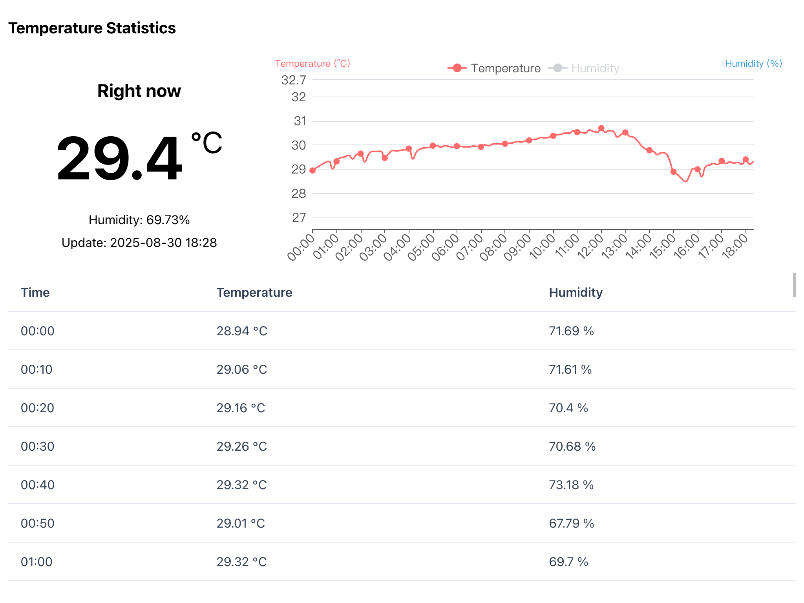
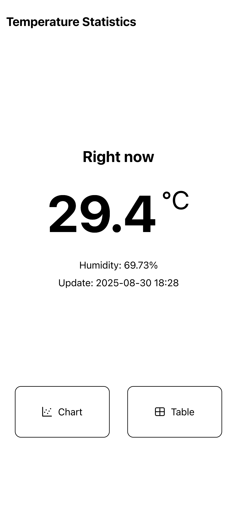

# SHT API

针对树莓派（开发板）的SHT温度/湿度API和数据存储  
SHT temperature & humidity API and data storage for Raspberry Pi (NOT Pico)

## API

  
获取当前温度和湿度数据  
Get current temperature and humidity

  
?`year`&`month`&`day`  
获取指定日期的所有温湿度数据  
Get all temperature and humidity data for a specified date

  
获取最高气温的数据  
Get the highest temperature data

  
获取最低气温的数据  
Get the lowest temperature data

  
?`year`&`month`&`day`  
获取指定日期高气温的数据
Get the highest temperature data for a specified date

  
?`year`&`month`&`day`  
获取指定日期低气温的数据  
Get the lowest temperature data for a specified date

## 响应 | Response

```json
{
    "timestamp": "2025-01-01 00:00:00",
    "temperature": 10,
    "humidity": 60
}
```

## 前端示例 FrontEnd Example




## 使用Docker部署

> [!NOTE]
> 你需要修改下面命令中带有尖括号的内容（包括尖括号本身）

```bash
sudo docker run -d \
--restart always \
--name sht \
-p <主机端口>:8080 \
-v <主机上存储数据库的位置*>:/app/db \
--device /dev/i2c-1 \
zhouc1230/sht:latest
```

*任意，保证存在并且可以读写的目录即可

## 更新

```bash
# 拉取最新镜像
docker pull zhouc1230/sht:latest
# 停止旧容器
docker stop sht
# 删除旧容器
docker rm sht
# 启动新容器
sudo docker run -d \
--restart always \
--name sht \
-p <主机端口>:8080 \
-v <主机上存储数据库的位置*>:/app/db \
--device /dev/i2c-1 \
zhouc1230/sht:latest
```