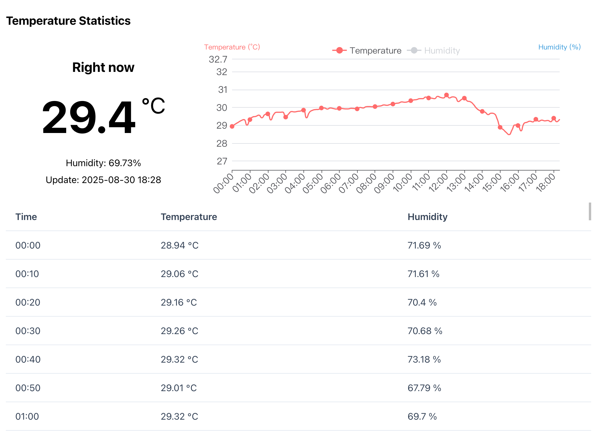
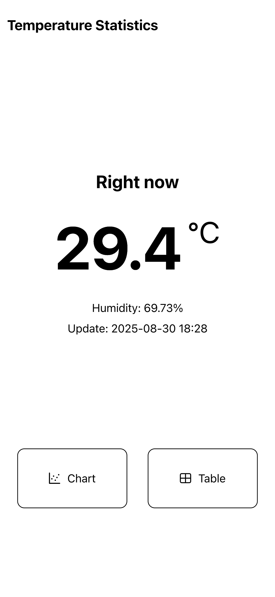

# SHT Viz

## Introduction


SHT sensor visualization system for Raspberry Pi. Deployed with Docker.

Front-End Repo is [HERE](https://github.com/Zhoucheng133/SHT-Viz-Web)

## Screenshots




## Deploy with Docker

> [!NOTE]
> You need to modify the content in the angle brackets

```bash
sudo docker run -d \
--restart always \
--name sht \
-p <Host Port>:8080 \
-v <Location of database on host*>:/app/db \
--device /dev/i2c-1 \
zhouc1230/sht:latest
```

*Any directory that exists and can be read and written is acceptable.

## Update

```bash
# Pull latest image
docker pull zhouc1230/sht:latest
# Stop old container
docker stop sht
# Delete old container
docker rm sht
# Start new container
sudo docker run -d \
--restart always \
--name sht \
-p <Host Port>:8080 \
-v <Location of database on host*>:/app/db \
--device /dev/i2c-1 \
zhouc1230/sht:latest
```

## API

  
Get current temperature and humidity

  
?`year`&`month`&`day`  
Get all temperature and humidity data for a specified date

  
Get the highest temperature data

  
Get the lowest temperature data

  
?`year`&`month`&`day`  
Get the highest temperature data for a specified date

  
?`year`&`month`&`day`  
Get the lowest temperature data for a specified date

### Response

```json
{
    "timestamp": "2025-01-01 00:00:00",
    "temperature": 10,
    "humidity": 60
}
```